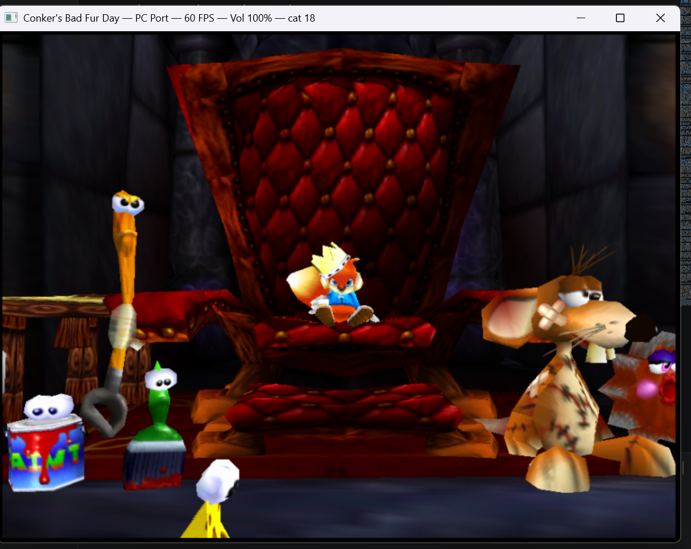
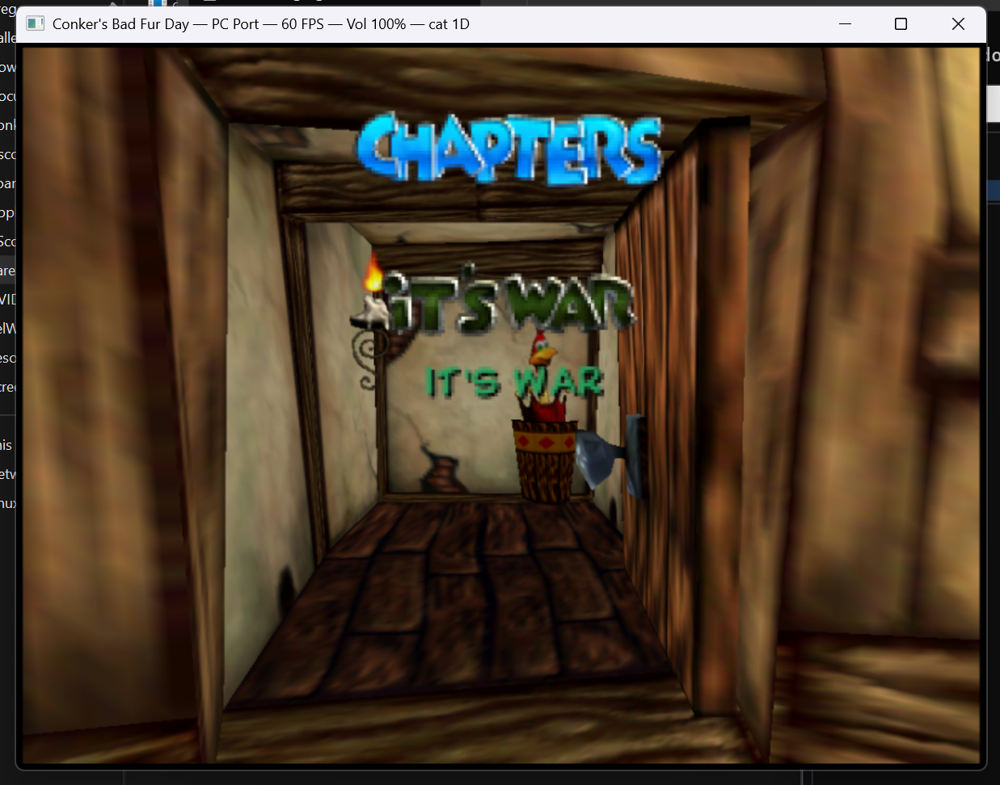
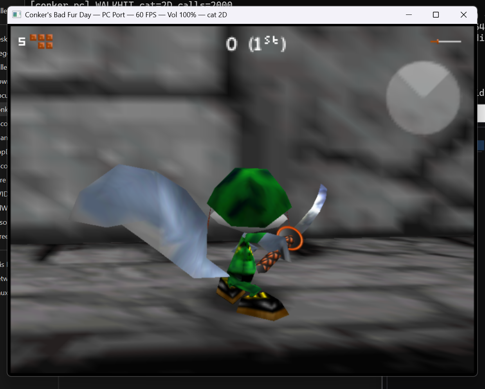
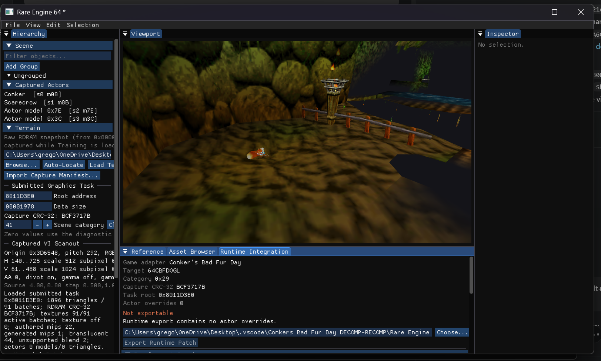

# Conker's Bad Fur Day (N64) Decompilation

A work-in-progress decompilation of *Conker's Bad Fur Day* for Nintendo 64.
The project reconstructs the original game code and data in a form that can be
built, studied, and matched against the retail ROM.

> [!IMPORTANT]
> This repository does not contain game assets or ROM files. You must provide
> your own legally obtained copy of the game.

## A little look

<p align="center">
  <a href="DOCS/images/readme/conker-throne.png">
    
  </a>
</p>

<p align="center">
  <a href="DOCS/images/readme/chapters-its-war.png">
    
  </a>
  <a href="DOCS/images/readme/gregg-gameplay.png">
    
  </a>
  <a href="DOCS/images/readme/rare-engine-64-editor.png">
    
  </a>
</p>

Current measurements, verified build state, and the active resume boundary are
maintained in [Current Decomp Status](DOCS/CURRENT_STATUS.md). PC-port progress
and cross-project boundaries are maintained separately in the
[PC Port Roadmap](DOCS/PC_PORT_ROADMAP.md).

## Status

Snapshot verified on 2026-10-10. "Converted" means a function has C source;
"byte-exact" means its linked instructions match the retail game. See
[Current Decomp Status](DOCS/CURRENT_STATUS.md) for the detailed handoff.

| Section | Converted functions | Converted bytes |
| --- | ---: | ---: |
| Total | 5,489 / 6,042 (90.85%) | 85.98% |
| Init | 492 / 539 (91.28%) | 92.53% |
| Game | 4,816 / 5,321 (90.51%) | 85.33% |
| Debugger | 181 / 182 (99.45%) | 99.19% |

| Section | Byte-exact | Address drift | Still different |
| --- | ---: | ---: | ---: |
| Total | `[##############----------]` 3,424 / 5,489 (62.38%) | 0 | 2,065 |
| Init | `[########################]` 492 / 492 (100.00%) | 0 | 0 |
| Game | `[#############-----------]` 2,751 / 4,816 (57.12%) | 0 | 2,065 |
| Debugger | `[########################]` 181 / 181 (100.00%) | 0 | 0 |

Function-by-function recovery updates and their supporting working-note links
are maintained in the [Update Log](DOCS/UPDATE_LOG.md), not in this overview.

## Build overview

Docker is the easiest supported environment. Native Linux and WSL also work;
native Windows without WSL or Docker is not supported by the matching IDO
toolchain.

1. Clone the repository with its submodules.
2. Place a big-endian US ROM at the repository root as `baserom.us.z64`.
3. Verify and extract the ROM.
4. Build the `conker/` code project.
5. Replace the rebuilt code sections and rebuild the ROM.

```sh
git clone --recursive https://github.com/gipson-dev/64CBFD.git
cd 64CBFD

make check
make extract
make -C conker extract
make -C conker --jobs
make -C conker replace NON_MATCHING=1
make --jobs
```

Validate the repository-local MIPS object wrappers independently with
`make tools-check`; this does not require a ROM. See
[project tools](DOCS/TOOLS.md) for usage and compatibility notes.

The decomp tools now live in
[64CBFD-Tools](https://github.com/gipson-dev/64CBFD-Tools), pinned here as the
`tools/` submodule. After pulling the split, existing checkouts can run
`bash scripts/bootstrap-tools.sh` to preserve their nested dependencies and
initialize the new tools parent. See
[tools repository setup](DOCS/TOOLS_REPOSITORY.md) for the migration and
contribution workflow.

An unmatched development build may end with `build/conker.us.z64: FAILED`.
That means the rebuilt ROM differs from retail; it does not necessarily mean
the compiler or extraction setup is broken. Follow the
[complete build instructions](DOCS/PROJECT.md#normal-build-steps) for version,
ROM byte order, Docker, WSL, and troubleshooting details.

## Contributing

The most useful current work is byte matching game functions, finishing the
small raw-assembly remainder, documenting asset formats, and improving build
tools.

For function work, start with the
[contributor and byte-matching guide](DOCS/CONTRIBUTING.md). It covers the
normal edit/build/measure loop, retail-span constraints, generated slices,
compiler-sensitive patterns, and the checks expected before a change is
published.

## Documentation

Documentation is organized by purpose in the [documentation index](DOCS/README.md):

- **Current status:** [Decomp status](DOCS/CURRENT_STATUS.md) and
  [PC port roadmap](DOCS/PC_PORT_ROADMAP.md)
- **Start and build:** [Project overview](DOCS/PROJECT.md) and
  [code sub-project](DOCS/CODE_SUBPROJECT.md)
- **Contribute:** [Contributor and byte-matching guide](DOCS/CONTRIBUTING.md)
- **Formats and tooling:** [Asset formats](DOCS/ASSET_FORMATS.md),
  [compressed config sections](DOCS/CONFIG.md), and
  [IDO toolchain](DOCS/IDO_RECOMP.md)
- **History:** [Update log](DOCS/UPDATE_LOG.md) and
  [working notes](DOCS/WORKING_NOTES.md)
